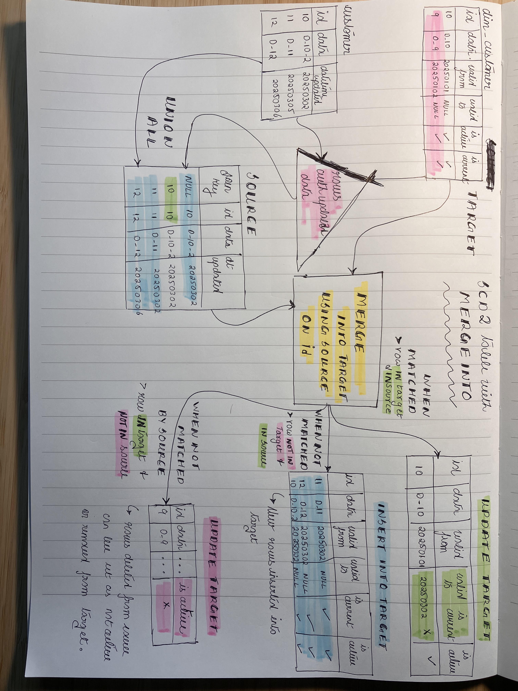

Repository for the following blog posts

1. **[Quickly deliver business value to end users](https://www.startdataengineering.com/post/deliver-data-quickly-with-schema-evolution-and-adv-data-types/)**
2. **[How to create an SCD2 table using MERGE INTO](https://www.startdataengineering.com/post/deliver-data-quickly-with-schema-evolution-and-adv-data-types/)**

## Setup

### Pre-requisites

1. [Docker and docker compose](https://docs.docker.com/compose/install/)

Clone this repo, cd into it and start the docker containers as shown below:

```bash
git clone
cd data_engineering_systems
docker compose up -d
sleep 30 # wait 30s to give docker to start up
```

The docker compose will also start a jupyter server that you can open by going to [http://localhost:8888](http://localhost:8888).

## Creating SCD2 Table using MERGE INTO with Apache Spark and Apache Iceberg

Blog at: **[How to create an SCD2 table using MERGE INTO](https://www.startdataengineering.com/post/deliver-data-quickly-with-schema-evolution-and-adv-data-types/)**

**[Notebook code](./notebooks/Use%20MERGE%20INTO%20to%20create%20SCD2%20dimension%20with%20Spark%20and%20Iceberg.ipynb)**



## Advanced data types and Schema evolution

Blog for this section is available at **[How to quickly deliver data to business users? #1. Adv Data types & Schema evolution](https://www.startdataengineering.com/post/deliver-data-quickly-with-schema-evolution-and-adv-data-types/)**.

Open JupyterLab for this section by **[clicking on this link](http://localhost:8888/doc/tree/notebooks/automate_data_flow.ipynb) after starting the docker containers**.

## Stop

Finally stop the running docker containers with:
```bash
docker compose stop 
```
